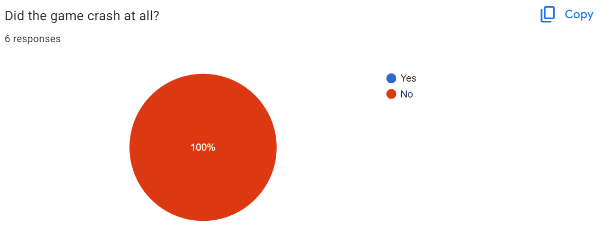

# 1.4a Features of Proposed Solution

## Broad Category 1

**Controls**

Clicker games generally do not have complex controls and usually involve simply clicking buttons that are on the screen using the right mouse button. However to make the game easier to play and more interesting, I will add shortcuts for certain sections and buttons featured in the game. This will also allow for faster paced gameplay and player will be able to perform activities in the game at a faster speed.

**Graphics**

My game will most likely not use complex artwork or graphics as it is not necessary. My game will consist of buttons and perhaps simple artwork in order to help the player understand certain aspects of the game and to help visualise them. Creating complex graphics will be very time consuming and as I have very limited time, more time will be invested into making the game functional rather than designing graphics.

**Layout and Design**

My game will mostly feature simple buttons, text and some images for visualisation throughout my game. This is because clicker games and IDLE games do not need to have complex layouts and designs.

<figure><figcaption></figcaption></figure>

I will likely have a few different sections with different layouts which will make up different aspects of the game, for example inventory, map, quests etc.

<figure><figcaption></figcaption></figure>

**User Interface**

My game will be using a very simple user interface consisting of buttons and different sections and windows. Within the game, the user interface will have buttons for boosts and upgrades. There will be buttons for achievements and rewards as well. If my game has any aspects of multiplayer, I will include a leader board so that players can compare progress within the game.

## Game Mechanics

**IDLE mechanics**

My game will feature IDLE mechanics which will allow the player to progress through the game when it is not open. This will include cooldown times for upgrades, automated collection of resources, etc. Players will be able to accumulate resources so that when the game is loaded again, the game will have continued as though it was not closed.

This makes the game appealing to players as it does not require much maintenance and does not demand the players attention for long times in order to make progression within the game.&#x20;

**Random Events**

My game will feature random events of different frequencies determined by the rarity and value of the events. These events could include special offers for upgrades and boosts, limited time purchases for unique items, trades for different items in the game, etc.

This will make the game more appealing to the players as random events will make game play more immersive. Random events all add variation to the game rather than clicking and waiting.

**Incremental Progression**

Incremental games feature progression which occurs in small steps rather than large leaps. Incremental progression is used in clicker games because it creates a sense of constant growth and reward for the player.

My game will feature experience points which will be accumulated from completing quests and tasks and experience points will contribute to increasing the players level which will unlock more upgrades and boosts etc.

## Limitations

**Graphics and game artwork**

My game will have very simple graphics and will have images representative of what they are meant to be rather than specific artwork. This is because creating graphics takes a very long time and I must focus on improving functionality of the game and therefore havent the time to create graphics. However, if I have time at the end, I will create graphics and artwork for my game.

**Game play**

The length of gameplay of my game will be limited by the limited time I have to create the game, and therefore the game may be completed quickly. I will not be including many stages to my clicker game. Therefore it will not take long to complete the game.

**Performance**

The performance of my game will be limited by the capabilities of the device that my game is being run on.

**Platforms**

In order to completely focus on the functionality of my game, I will be designing the game only to be played on PC with a Keyboard and mouse. Therefore I will not be spending time creating controls for other platforms such as including touchscreen controls for mobile phones.

